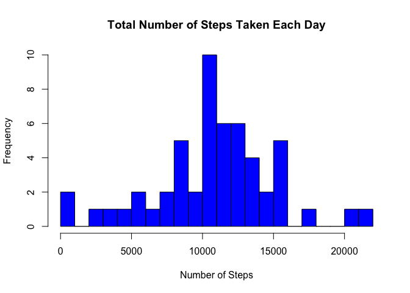
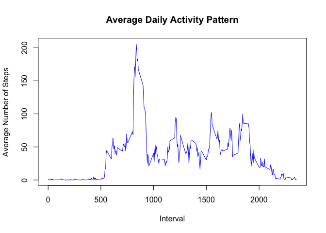
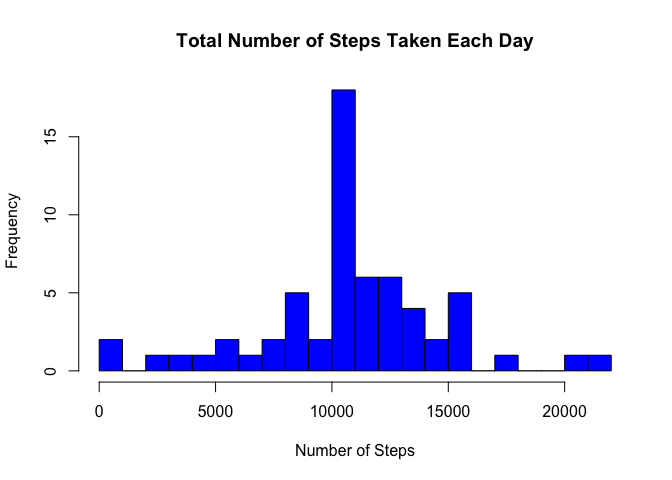
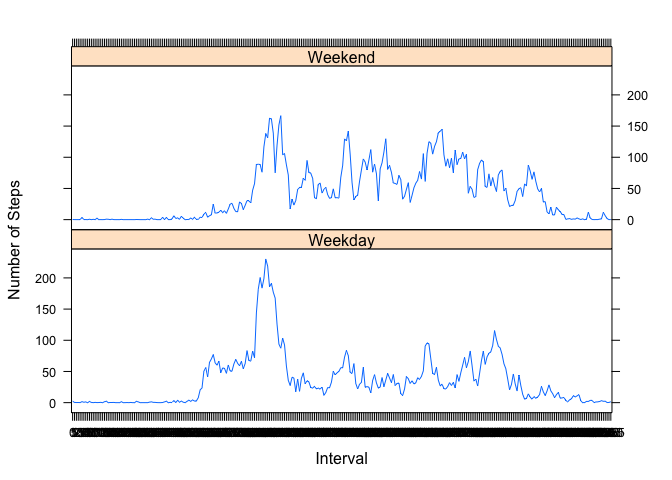

## Loading and Preprocessing the Data
First, set the working directory


```r
setwd("~/Documents/Data Science Files/Course 5/Project 1")
```

Next, load the raw data into the directory if it is not already there


```r
if(!file.exists("activity.csv")) {
  downloadURL <- "http://d396qusza40orc.cloudfront.net/repdata%2Fdata%2Factivity.zip"
  download.file(downloadURL, destfile = "repdata%2Fdata%2Factivity.zip", mode = "wb")
  unzip("repdata%2Fdata%2Factivity.zip")
  }

data <- read.csv("activity.csv", header = TRUE, sep = ",", na.strings = "NA")
```

Convert the "date" variable to a class and the "interval" variable to a factor


```r
data$date <- as.Date(data$date, format = "%Y-%m-%d")
data$interval <- factor(data$interval)
```

***

## What is mean total number of steps taken per day?
First, subset the dataset the ignore missing values


```r
allNA <- is.na(as.character(data$steps))
newData <- data[!allNA, ]
```

Next, aggregate the number of steps taken each day by creating a data frame with the number of steps taken per day and adding column names to said data frame


```r
stepsPerDay <- aggregate(steps ~ date, data = newData, sum)
colnames(stepsPerDay) <- c("date", "steps")
```

Now it's time to make a histogram using our new data frame


```r
hist(as.numeric(stepsPerDay$steps), breaks = 20, col = "blue", xlab = "Number of Steps", main= "Total Number of Steps Taken Each Day")
```

<!-- -->

Finally, calculate and report the mean and median total number of steps taken per day


```r
mean <- mean(stepsPerDay$steps)
median <- median(stepsPerDay$steps)
cat("The mean total number of steps taken per day is", mean)
```

```
## The mean total number of steps taken per day is 10766.19
```

```r
cat("The median total number of steps taken per day is", median)
```

```
## The median total number of steps taken per day is 10765
```

***

## What is the average daily activity pattern?
First, calculate the average number of steps taken, averaged across all days. Add column names to your result


```r
stepsPerInterval <- aggregate(newData$steps, by = list(interval = newData$interval), FUN = mean)
colnames(stepsPerInterval) <- c("interval", "averageSteps")
```

Next, plot your result


```r
plot(as.integer(levels(stepsPerInterval$interval)), stepsPerInterval$averageSteps, type="l", xlab = "Interval", ylab = "Average Number of Steps", main = "Average Daily Activity Pattern", col ="blue")
```

<!-- -->

Now, let's find and report the 5-minute interval that contains the maximum number of steps. 


```r
maxSteps <- max(stepsPerInterval$averageSteps)
maxInterval <- stepsPerInterval[which.max(stepsPerInterval$averageSteps), ]$interval
maxInterval
```

```
## [1] 835
## 288 Levels: 0 5 10 15 20 25 30 35 40 45 50 55 100 105 110 115 120 ... 2355
```

The 5-minute interval that contains the maximum number of steps is the 835th interval with 206.2 steps

***

## Imputing missing values
Calculate and report the total number of missing values in the dataset


```r
totalNA <- sum(!complete.cases(data))
cat("The total number of missing values in the dataset is", totalNA)
```

```
## The total number of missing values in the dataset is 2304
```

Next, fill in all the missing values in the dataset. To do this, we will find the indices of the missing values, then we will impute the missing values using the mean for that 5-minute interval, creating a new dataset that is equal to the original but with the missing data filled in. 


```r
indexNA <- which(is.na(as.character(data$steps)))
completeData <- data
completeData[indexNA, ]$steps <- unlist(lapply(indexNA, FUN = function(indexNA) {
  stepsPerInterval[data[indexNA, ]$interval == stepsPerInterval$interval, ]$averageSteps
  }))
```

Now, create a data frame consisting of the steps taken per day and add column names to said data frame


```r
stepsPerDayComplete <- aggregate(steps ~ date, data = completeData, sum)
colnames(stepsPerDayComplete) <- c("date", "steps")
```

Make a histogram of your result


```r
hist(as.numeric(stepsPerDayComplete$steps), breaks = 20, col = "blue", xlab = "Number of Steps", main= "Total Number of Steps Taken Each Day")
```

<!-- -->

Now, we will calculate and report the mean and median total number of steps taken per day for the complete dataset


```r
meanComplete <- mean(stepsPerDayComplete$steps)
medianComplete <- median(stepsPerDayComplete$steps)
cat("The mean total number of steps taken per day for the complete dataset is", meanComplete)
```

```
## The mean total number of steps taken per day for the complete dataset is 10766.19
```

```r
cat("The median total number of steps taken per day for the complete dataset is", medianComplete)
```

```
## The median total number of steps taken per day for the complete dataset is 10766.19
```

Finally, let's compare these values to the estimates from the first part of the assignment


```r
meanDifference <- meanComplete - mean
medianDifference <- medianComplete - median
meanDifference
```

```
## [1] 0
```

```r
medianDifference
```

```
## [1] 1.188679
```

Looking at the results, we see that the mean of the complete dataset is equal to our earlier estimate, while there is a slight variance between the median values. Therefore, there is a relatively low impact of imputing missing data on the estimates, as the two datasets are almost identical

***

## Are there differences in activity patterns between weekdays and weekends?
First, create a factor variable to store the day of the week, and a logical vector to indicate whether the given day is a weekday or weekend 


```r
completeData$day <- as.factor(weekdays(completeData$date))
completeData$weekday <- ifelse(!(completeData$day %in% c("Saturday", "Sunday")), TRUE, FALSE)
```

Now, create datasets for both the average number of steps for weekdays and the average number of steps for weekends


```r
weekdayData <- completeData[completeData$weekday, ]
stepsPerIntervalWeekday <- aggregate(weekdayData$steps, by = list(interval = weekdayData$interval), FUN = mean)
weekendData <- completeData[!completeData$weekday, ]
stepsPerIntervalWeekend <- aggregate(weekendData$steps, by = list(interval = weekendData$interval), FUN = mean)
```

Merge the two datasets together, adding column names in the process, then convert the day variable to a factor


```r
colnames(stepsPerIntervalWeekday) <- c("interval", "averageSteps")
colnames(stepsPerIntervalWeekend) <- c("interval", "averageSteps")
stepsPerIntervalWeekday$day <- "Weekday"
stepsPerIntervalWeekend$day <- "Weekend"
weekData <- rbind(stepsPerIntervalWeekend, stepsPerIntervalWeekday)
weekData$day <- as.factor(weekData$day)
```

Make a plot to compare and contrast the average number of steps taken across all weekends and weekdays


```r
library(lattice)
xyplot(averageSteps ~ interval | day, data = weekData, layout = c(1, 2), type = "l", xlab = "Interval", ylab = "Number of Steps")
```

<!-- -->

As the plot shows, there is a high peak in activity earlier on in the day on weekdays, and activity is more spread out throughout the day on weekends
